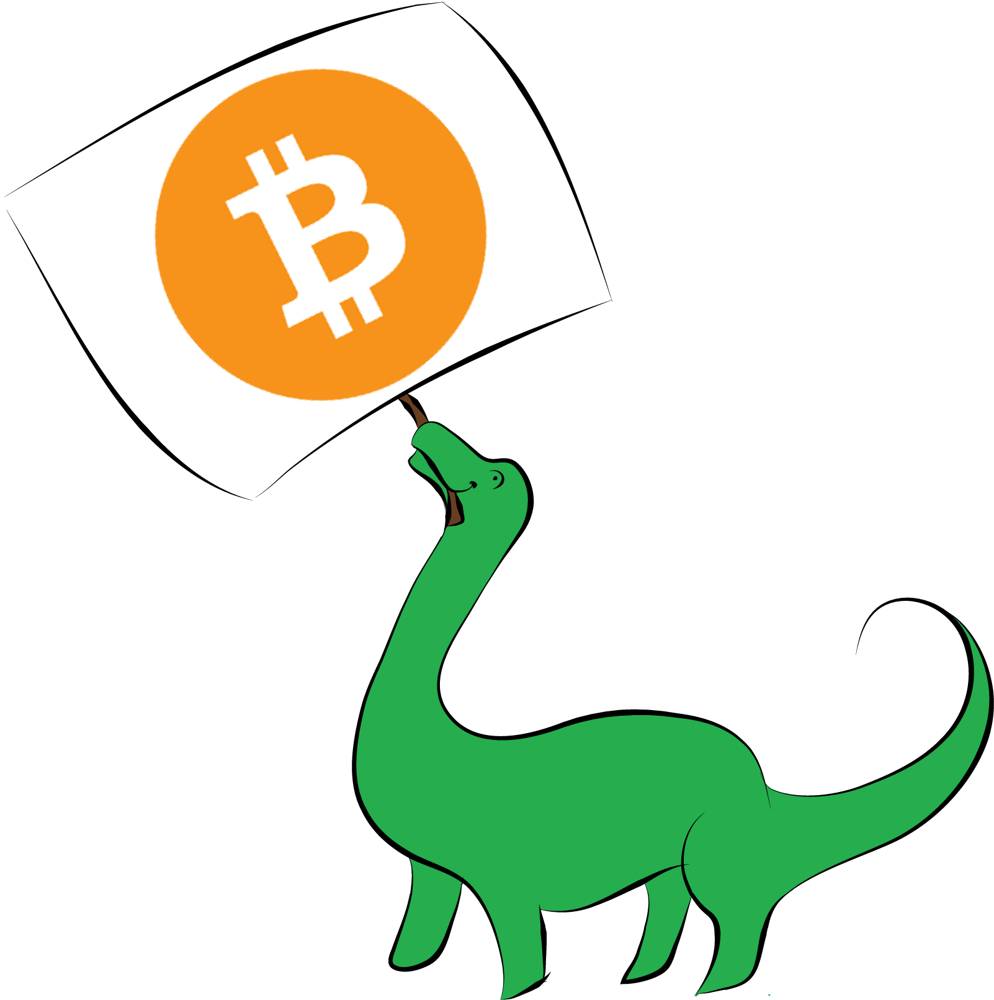
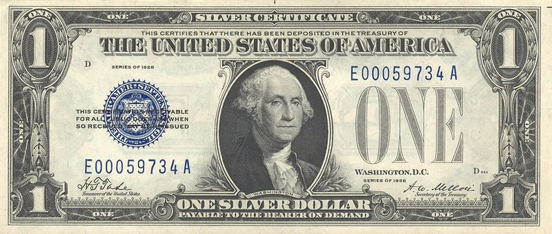
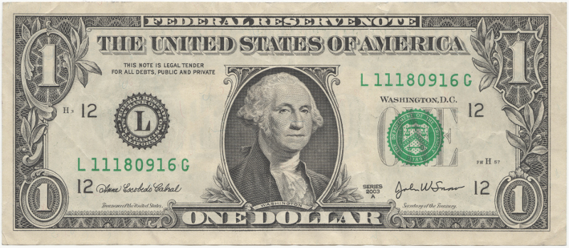
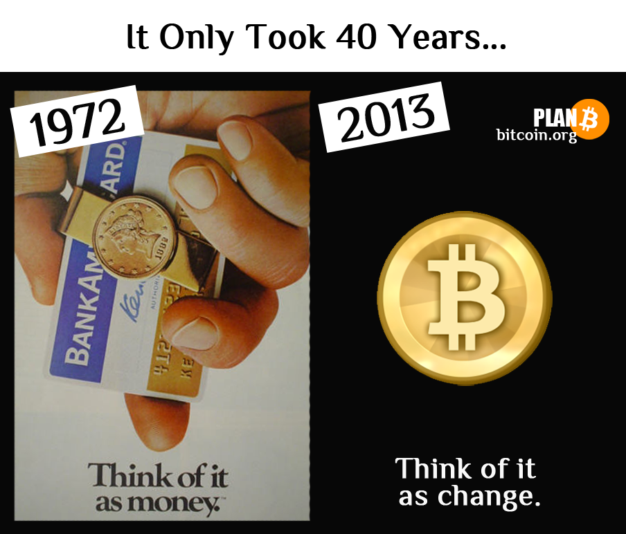
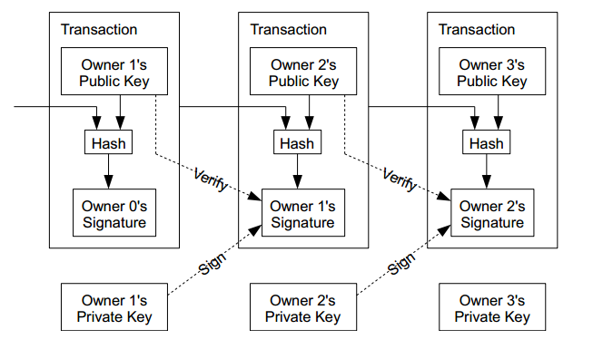
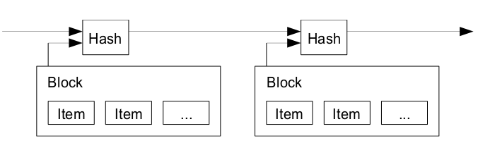

# Bitcoin

!SLIDE

# "Bitcoin" by [dinosaur](https://dinosaur.io)

!SLIDE

# what is money?

- [money](http://wiki.mises.org/wiki/Money) is something used as a medium of exchange between equal values of work and resources.
  - store of value
  - transaction medium

!SLIDE

# barter

example: a chicken for a bundle of lumber

## limitations

- both people involved need to have what the other wants
- absence of common measure of value
- not all items are divisible
- perishable items depreciate in value quickly

!SLIDE

# commodities

allow for single medium of exchange

- cattle (cows, camels, goats, ...)
- shells
- tools
- tobacco
- cotton
- copper
- silver
- gold

...

!SLIDE

# precious metals

preferred because of their physical properties

- scarce
- durable
- divisible
- has distinct look and sound
- homogeneous
- malleable
- beautiful

!SLIDE

# paper placeholders

instead of carrying physical commodities, people started using paper notes, token coins, credit cards, and electronic bank accounts to act as placeholders for actual money

!SLIDE

# fiat value

instead of 1:1 relationship between paper notes and physical commodities, banks began to simply declare by government decree that the paper notes have value.

!SLIDE

# unbounded supply

fiat money allows banks to create more placeholder money at will.
- currently happening at the rate of <a href="http://www.federalreserve.gov/newsevents/press/monetary/20120913a.htm">$85</a> billion USD per month
- [money supply becomes political tool of nation-states](http://www.amazon.com/dp/1591845564)

!SLIDE

# [compare with Bitcoin](http://bitcoin.stackexchange.com/questions/2834/what-are-the-perceived-advantages-of-bitcoin-as-a-store-of-value)

Bitcoin decentralizes control of money supply

!SLIDE left

# transactional friction

- high fees, not possible to pay on weekends
- making payments today requires trusting a 3rd-party
  - bank, credit union, credit card company, ...
- these 3rd-parties mediate disputes through non-reversible transactions (chargebacks)
  - increases costs and limits minimum transaction size
  - with possibility of reversal, need for trust spreads

!SLIDE

# [compare with Bitcoin](http://bitcoin.stackexchange.com/questions/305/what-are-the-perceived-advantages-of-bitcoin-as-a-means-of-exchange)

    "What is needed is an electronic payment system based on cryptographic proof instead of trust, allowing any two willing parties to transact directly with each other without the need for a trusted third party"

!SLIDE

!SLIDE

# how does Bitcoin work?

[Satoshi Nakamoto's original whitepaper](images/bitcoin.pdf)

!SLIDE

# what is a bitcoin?

    "We define an electronic coin as a chain of digital signatures. Each owner transfers the coin to the next by digitally signing a hash of the previous transaction and the public key of the next owner and adding these to the end of the coin. A payee can verify the signatures to verify the chain of ownership."

!SLIDE left

# double-spend
    
    "The problem of course is the payee can't verify that one of the owners did not double-spend the coin."

- common solution is to introduce a trusted central authority
  - after each transaction, return coin to mint
  - mint checks transaction and issues new coin
- problem is entire money system relies on this central authority

!SLIDE

# timestamp server

    "The solution we propose begins with a timestamp server. A timestamp server works by taking a hash of a block of items to be timestamped and widely publishing the hash... The timestamp proves that the data must have existed at the time, obviously, in order to get into the hash. Each timestamp includes the previous timestamp in its hash, forming a chain, with each additional timestamp reinforcing the ones before it."

!SLIDE left

# proof-of-work

    "To implement a distributed timestamp server on a peer-to-peer basis, we will need to use a proof-of-work system... The proof-of-work involves scanning for a value that when hashed, such as with SHA-256, the hash begins with a number of zero bits. The average work required is exponential in the number of zero bits required and can be verified by executing a single hash."

- solves the problem of determining representation in majority decision
making
  - one-CPU-one-vote
  - the majority decision is represented by the longest chain, which has the greatest proof-of-work effort invested in it

!SLIDE left

# decentralized trust

- if a majority of CPU power is controlled by honest nodes, the honest chain will grow the fastest and outpace any competing chains
- to modify a past block, an attacker would have to redo the proof-of-work of the block and all blocks after it and then catch up with and surpass the work of the honest nodes
  - probability of a slower attacker catching up diminishes exponentially as subsequent blocks are added
- to compensate for varience in mining power over time, the proof-of-work difficulty is determined by a moving average targeting 1 block every 10 minutes

!SLIDE left

# decentralized supply

    "By convention, the first transaction in a block is a special transaction that starts a new coin owned by the creator of the block. This adds an incentive for nodes to support the network, and provides a way to initially distribute coins into circulation, since there is no central authority to issue them."

- coin creation
  - starts at an initial rate of 50 coins per ~10 minutes (per block)
    - this rate halves roughly every ~4 years (210,000 blocks)
- optional transaction fees also incentize miners

!SLIDE

# practical usage of Bitcoin

!SLIDE

# wallets

- your wallet is a file and you do with it as you please
- full node wallets like bitcoin-qt
- thin client wallets like electrum
- online client-side wallets like [blockchain.info](https://blockchain.info)
- [paper/brain/vanity wallets](https://bitaddress.org)
- [hardware wallets](https://en.bitcoin.it/wiki/Hardware_wallet)

!SLIDE

# exchanging between
## fiat and crypto
  
- local exchanges like [localbitcoins](https://localbitcoins.com)
- online exchanges like [campbx](https://campbx.com/), [mtgox](https://mtgox.com/), etc
- online sellers like [coinbase](https://coinbase.com/), [bitinstant](https://www.bitinstant.com/), [btcquick](https://btcquick.com), etc
- local atms soon

!SLIDE

# transactions

- instant for unconfirmed
- ~10 minutes per confirmation
- available 24/7
- < 1% fees
- irreversible

!SLIDE

# who accepts bitcoin?
## [more than you think](https://en.bitcoin.it/wiki/Trade)

!SLIDE

# transaction history

- transactions are public to everyone on the blockchain
- traced to pseudonyms
- capable of true anonymity with <a href="https://torproject.org">tor</a> and <a href="https://blockchain.info/wallet/send-shared">coin mixing services</a>, or proposed <a href="http://spar.isi.jhu.edu/~mcgreen/ZerocoinOakland.pdf">zerocoin extension</a>

!SLIDE

# how to hack on [bitcoin](https://en.bitcoin.it/wiki/Main_Page)

- wallets
  - [bitcoin rpc](https://en.bitcoin.it/wiki/API_reference_(JSON-RPC\))
  - [blockchain.info](https://blockchain.info)
- payment processors
- fiat/btc exchange
- asset exchanges

!SLIDE

# questions?
## comments?
### email me at dinosaur@riseup.net

!SLIDE

# other sources

- <https://bitcointalk.org>
- <http://reddit.com/r/Bitcoin>
- <http://www.slideshare.net/KyleDrake/bitcoin-the-cyberpunk-cryptocurrency>
